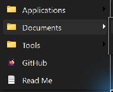
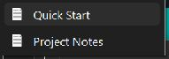

# Portable Windows Tray Launcher

**English** | [Deutsch](README.de.md)

A portable application launcher for Windows 11 that puts your apps, shortcuts, files and folders in the system tray. Fill a menu folder to create your own quick launch menu with submenus, file icons and custom ordering. Optional startup with Windows, no installation and no extra runtime required.

Built with native C++/Win32 for 64-bit Windows. Organize portable apps, keep everyday tools one click away and open documents or folders from the taskbar notification area.

## Download

**[Download the portable ZIP for Windows 64-bit](https://github.com/cTrares/Portable-Windows-Tray-Launcher/releases/latest/download/Portable-Windows-Tray-Launcher-win64.zip)**

Extract the entire ZIP to a writable folder and run `PortableTrayLauncher.exe` inside the extracted application folder. No build or installation is needed. [Release notes and downloads](https://github.com/cTrares/Portable-Windows-Tray-Launcher/releases/latest).

## Usage

### Screenshots

| Launcher menu | Documents submenu |
| --- | --- |
|  |  |

Actual menu captures using example entries. The folders on disk are named `01 Applications`, `02 Documents` and `03 Tools`; only their names are displayed. Numbered files appear below the folders.

The application runs entirely in the taskbar notification area. Windows may initially hide its icon in the tray overflow; drag it into the visible notification area if you prefer.

- **Left-click** to open the launcher menu immediately above the tray icon.
- **Right-click** to open the menu folder, enable or disable startup with Windows, or quit.
- **Configure your menu** by placing files, shortcuts and folders in `Menu` next to the EXE. Contents are read again each time you open the launcher menu.
- No main window, settings window, menu editor or continuous folder monitoring.

The current application interface uses German labels: **Menüordner öffnen** means “Open menu folder,” **Autostart aktivieren/deaktivieren** means “Enable/disable startup with Windows,” and **Beenden** means “Quit.”

You can copy or move the entire application folder. Shortcuts and their targets must remain valid at the new location. If startup with Windows was enabled, select **Autostart aktivieren** again after moving the application: Windows needs its absolute EXE path. Startup is stored per user under `HKCU\Software\Microsoft\Windows\CurrentVersion\Run`; administrator privileges are not required. Startup is never enabled automatically.

## Menu structure

The first level of folders appears as submenus. Further folders inside those submenus open in File Explorer. Files can also be placed directly in `Menu`. Hidden and system files such as `desktop.ini` are skipped.

Folders always appear above files and shortcuts. Within each group, leading digits, optionally followed by spaces, hyphens or underscores, control the order: for example, `01 Apps`, `02-Excel.lnk` or `03_Manual.pdf`. Numbered entries come first in numeric order, followed by unnumbered entries alphabetically. File extensions are hidden; names consisting entirely of numbers remain readable.

Entries open using the registered Windows Shell default action. For example, a PS1 file only executes if Windows would also execute it on a double-click. Shortcuts retain their arguments and working directory. Failed launches display a small native error dialog.

An empty folder offers **Menü ist leer** (“Menu is empty”) and **Menüordner öffnen** (“Open menu folder”). Use the arrow keys, Enter, Escape and first-letter navigation with the keyboard. Large menus use native Windows menu navigation.

## Appearance

Dark Windows-style colors: background `#202020`, highlight `#2D2D2D`, text `#F3F3F3`. Compact 30-DIP rows, Segoe UI, Shell file icons and DPI scaling. The supplied `AppIcon.png` is embedded in the EXE as a multi-resolution ICO; the original image is preserved.

The menu is a native Win32 popup anchored to the tray icon's actual position. Animation follows Windows settings, with the application requesting an upward opening direction.

## Restore and build from source

This repository contains the complete source, build scripts, Windows resources and PNG icon sources. Compilers, installed libraries and compiled executables are excluded from Git; ready-to-run ZIPs are provided as release downloads. Recorded local tool versions are listed in [DEPENDENCIES.md](DEPENDENCIES.md).

On a new Windows machine, install Git, PowerShell 7 and MSYS2 with the MinGW-w64 toolchain for **MINGW64/x86_64**. Install the build dependencies in an MSYS2 MINGW64 shell:

```sh
pacman -S --needed mingw-w64-x86_64-gcc mingw-w64-x86_64-binutils
```

Then clone the repository and build from PowerShell 7:

```powershell
git clone https://github.com/cTrares/Portable-Windows-Tray-Launcher.git
cd Portable-Windows-Tray-Launcher
.\build.ps1
# To specify the compiler directory explicitly:
.\build.ps1 -Toolchain 'C:\msys64\mingw64\bin'
```

The build script generates `app.ico` and `tray.ico` from the versioned PNG files and creates all build and output directories. The C++ runtime is linked statically. Output: `dist\PortableTrayLauncher`. The executable is named `PortableTrayLauncher.exe`. Only the EXE and `Menu` folder are needed to run the application.

Your personal `Menu` contents are not part of the source repository. The build creates an empty menu folder that you can fill with your own shortcuts and files. Back up those contents separately to restore a personal setup, and obtain installed or portable target applications separately.

## Tests

After building the application, the included development tests can be run from PowerShell:

```powershell
.\tests\run.ps1
.\tests\run.ps1 -Shell
```

The Shell tests deliberately open harmless test files, a browser and File Explorer. Any existing startup entry for this application is backed up and restored after the test. Registry tests need a normal user process outside a read-only test sandbox; they do not require administrator privileges.

Test sources are included in the repository; test executables and fixtures are generated when needed. The `tests` and `build` directories are not needed for normal use.
